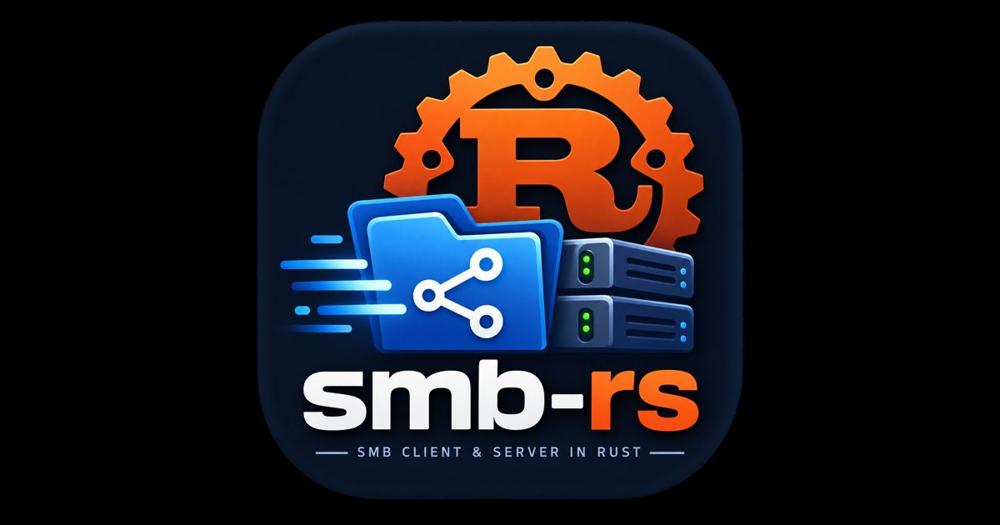

<p align="center">
  
</p>

<h1 align="center">smb-rs</h1>

<p align="center">
  <strong>An SMB1 / SMB2 / SMB3 file server written in Rust.</strong>
</p>

<p align="center">
  <a href="https://farazshaikh.github.io/smb-rs/">Project page &amp; API docs</a>
</p>

---

`smb-rs` is a from-scratch implementation of the SMB family of protocols,
built directly against the public Microsoft Open Specifications — [MS-CIFS],
[MS-SMB], [MS-SMB2] and [MS-NLMP]. It serves files and directories over the
network to standard clients (`smbclient`, Windows Explorer, macOS, the Linux
kernel CIFS upcall) with real NTLMv2 challenge/response authentication,
message signing on every dialect, and SMB 3.x negotiate contexts including
pre-authentication integrity and applied AES-GCM/CCM encryption.

It is organised as a focused cargo workspace (protocol codecs, transport,
VFS abstraction, POSIX backend, auth, crypto service provider, server) so
each layer stays readable and independently testable.

> **Why?** A readable, layered map of how SMB actually works on the wire —
> that is also a working file server.

---

## Feature highlights

| Area | What you get |
|---|---|
| **Dialects** | NT LM 0.12 (SMB1) · 2.0.2 · 2.1.0 · 3.0 · 3.0.2 · **3.1.1** |
| **Auth** | NTLMv2 verification, NTLMv1 fallback, RC4 key exchange, guest/anonymous mapping, multi-user DB |
| **Signing** | HMAC-SHA256 (SMB 2.x) and AES-CMAC (SMB 3.x) — responses signed, verified by Samba clients; optional `--require-signing` enforcement |
| **Encryption** | SMB3 transform applied to traffic — AES-128-GCM and AES-128-CCM, C2S/S2C key derivation bound to the pre-auth hash |
| **Compression** | SMB3 compression transform + `COMPRESSION_CAPABILITIES` context (LZNT1 / Pattern_V1) |
| **Pre-auth integrity** | SHA-512 chaining over all NEGOTIATE/SESSION_SETUP frames (3.1.1) |
| **File I/O** | Create/open (all six dispositions), read, write, close, flush, truncate, delete-on-close; large-MTU (>64 KiB) single-op reads/writes with multi-credit accounting |
| **Locking** | Byte-range locks **enforced** with a conflict matrix; share-mode conflict detection |
| **Oplocks & leases** | Exclusive oplocks and file leases (v2/v3) with break notifications |
| **Durable handles** | Durable / persistent handle grant and reconnect (DH2Q / DH2C) |
| **Directories** | Wildcard enumeration across six find-information levels, continuation + restart/resume-by-index, mkdir/rmdir, rename incl. rename-by-handle |
| **Change notify** | `CHANGE_NOTIFY` (recursive and non-recursive) backed by inotify |
| **Info levels** | Query/set for file & filesystem classes ([MS-FSCC]), security descriptors, alternate data streams, 8.3 short-name generation |
| **Server-side copy** | `FSCTL_SRV_REQUEST_RESUME_KEY` + `COPYCHUNK` (ODX offload), set-sparse / zero-data |
| **IOCTLs** | `VALIDATE_NEGOTIATE_INFO`, `LMR_REQ_RESILIENCY`, `PIPE_WAIT`, `DFS_GET_REFERRALS`, `QUERY_NETWORK_INTERFACE_INFO` |
| **Multichannel** | Interface discovery + session binding capability advertised |
| **IPC$ / named pipes** | srvsvc `NetShareEnum` share enumeration, RPC bind/transact over named pipes ([MS-RPCE]) |
| **Compounding** | Multi-request frames handled with 8-byte-aligned chained replies |
| **Observability** | `tracing` structured logs (EnvFilter) + Prometheus metrics endpoint |

Verified interoperable against:

| Client | Dialects exercised | Status |
|---|---|---|
| Samba `smbclient` 4.x | NT1 · SMB2 · SMB3 (guest, authenticated+signed, `--client-protection=encrypt`) | ✅ full suite |
| Impacket `SMB` / `SMB3` classes | 2.1 + 3.x flows, DCERPC bind/request | ✅ full suite |
| `smbprotocol` (Python) | 3.x create/read/write, locks, leases, durable, notify, ADS, security, large-MTU | ✅ feature battery |

## Status & roadmap

The **core `[MS-SMB2]` protocol is fully implemented** and verified
end-to-end against real clients. Working today: negotiation (all dialects
above), SPNEGO/NTLMSSP session setup (both legs), signing on every dialect
and SMB3 encryption applied to traffic, tree connects, create/open, read,
write (incl. large-MTU multi-credit), close, flush, **enforced** byte-range
locks and share-mode conflict detection, oplocks, leases, durable handles,
directory enumeration with continuation/resume, query/set information,
security descriptors, alternate data streams, `CHANGE_NOTIFY`, server-side
copychunk, compound frames, IPC$ named pipes with srvsvc share enumeration,
and compression. Unsupported requests are rejected cleanly with proper NT
status codes.

A command-by-command status table (every SMB1/SMB2 opcode and FSCTL) lives
in [docs/command_status.md](docs/command_status.md). Per-feature detail
(spec section, status, unit/system tests, benchmarking, logging, metrics)
lives in [docs/IMPLEMENTATION_PLAN.md](docs/IMPLEMENTATION_PLAN.md)'s
**Feature Matrix**.

### Roadmap

Every remaining gap below is backed by an actual skip in the `protocol`
suite ([test_status.csv](test_status.csv)) — nothing here is speculative:

| Item | Spec | Skipped tests |
|---|---|---|
| SMB Direct (RDMA transport) | [MS-SMBD] | 3 |
| SMB-over-QUIC transport (server is TCP-only) | [MS-SMB2] §3.1.4 | 1 |
| Xpress-Huffman (LZ77+Huffman) compression encoder — decode works, encode needs a Huffman-table encoder (available Rust crates are decode-only) | [MS-XCA] | 3 |
| Resilient handle reconnect + scavenger timer | [MS-SMB2] §3.3.5.9 | 2 |
| Previous-version (VSS) snapshot enumeration — `FSCTL_SRV_ENUMERATE_SNAPSHOTS` needs snapshot support in the POSIX backend | [MS-SMB2] §2.2.31.3 | 1 |
| Session-binding lookup for `SessionId=0` + `SESSION_FLAG_BINDING` + no `PreviousSessionId` | [MS-SMB2] §3.3.5.5.2 | 1 |

The remaining skips are test-environment/harness limitations rather than
server gaps (a domain-join assumption, an encryption-required test-config
guard, a client-side SSPI defect in the reauth test harness, an invalid SDDL
value in ptfconfig) — see the `note` column in
[test_status.csv](test_status.csv) for each.

Run it on trusted networks; treat it as an interoperability/reference
implementation that is steadily growing production features.

## Conformance test suite

Three suites under [test/](test/README.md) exercise the server and track
pass/fail across runs: in-process Rust `unit` tests, a `system` harness driven
through a Python `smbprotocol` actuator, and the official `protocol` suite —
Microsoft's [WindowsProtocolTestSuites](https://github.com/microsoft/WindowsProtocolTestSuites)
MS-SMB2 Server Test Suite, vendored as the [`test/wpts`](test/wpts) submodule.
`test/runtest.sh` runs any or all of them, verifying a server is up first, and
keeps the summary below and [`test_status.csv`](test_status.csv) in sync.

<!-- TEST_STATUS_START -->

**433 tests · 418 passed · 0 failed · 15 skipped · 100.0% pass rate** (commit `e24ab7a`, 2026-09-02)

| Suite | What it runs | Passed | Failed | Skipped | Total |
|---|---|---|---|---|---|
| **protocol** | Microsoft's official MS-SMB2 Server Test Suite (Windows Protocol Test Suites) | 271 | 0 | 15 | 286 |
| **system** | End-to-end interop tests driving a live server through the Python `smbprotocol` client | 34 | 0 | 0 | 34 |
| **unit** | In-process Rust unit & integration tests (`cargo test --workspace`) | 113 | 0 | 0 | 113 |

Generated from [`test_status.csv`](test_status.csv) by [`test/lib/render_readme_status.py`](test/lib/render_readme_status.py) after a test run. Live view: `smb-test-dashboard` (see [test/README.md](test/README.md)).

<!-- TEST_STATUS_END -->

```sh
# run everything (unit + system + protocol), health-checking servers first
test/runtest.sh

# one suite at a time
test/runtest.sh --suite unit
test/runtest.sh --suite system
test/runtest.sh --suite protocol       # needs the .NET SDK; see test/README.md

# one-time prerequisite setup (build, python deps, protocol-suite patching)
test/runtest.sh --setup

# interactive: point cargo test at a running server (skips cleanly if unset)
SMB_TEST_HOST=127.0.0.1 SMB_TEST_PORT=4450 cargo test -p smb-testsuite

# containerised build + run (system suite)
docker build -f test/Dockerfile -t smb-rs-test .
docker run --rm --security-opt seccomp=unconfined \
    -v "$PWD/test/data:/work/test/data" smb-rs-test
```

Results are committed under [test/data/](test/data/) — per-run JSON, `summary.csv`,
`history.csv`, and a zero-dependency history viewer (`test/data/index.html`) that
renders pass-rate trends and the latest run without a server.

---

## Building

```sh
git clone https://github.com/farazshaikh/smb-rs.git
cd smb-rs
cargo build --release --workspace   # → target/release/rustsmb
```

### Crypto backend selection

Cryptography lives in the [`crates/smb-csp`](crates/smb-csp) service-provider
crate behind one API surface with two compile-time backends:

| Backend | Build command | Notes |
|---|---|---|
| `lib` (**default**) | `cargo build --release --workspace` | Maintained RustCrypto crates (`sha2`, `aes`, `cmac`, `hmac`, `des`, `rc4`, `md4`, `md-5`) — hardware-accelerated AES where available |
| `handrolled` | `cargo build --release --workspace --no-default-features --features handrolled` | Bundled from-scratch implementations; zero external dependencies |

Both backends must satisfy the same FIPS/RFC/interop vector suite
(enforced by tests inside `smb-csp`).

## Running

```
rustsmb [OPTIONS]
```

| Option | Meaning | Default |
|---|---|---|
| `-p, --port` | TCP listen port (SMB tradition is 445) | `4450` |
| `-s, --share NAME=PATH` | Publish a share (repeatable) | `public=<cwd>` |
| `-u, --user USER:PASSWORD` | Add an account (repeatable) | none → guest mode |
| `--log FILTER` | `tracing` EnvFilter (`RUST_LOG` overrides) | `info` |
| `--metrics-bind ADDR` | Serve Prometheus at `http://ADDR/metrics` | off |
| `--require-signing` | Reject unsigned traffic from authenticated sessions | off |

Examples:

```sh
# Guest-readable/writable share
./target/release/rustsmb -p 4450 -s public=$HOME/public

# Two shares, two accounts, metrics on
./target/release/rustsmb -p 4450 \
    -s media=/srv/media -s scratch=/tmp/scratch \
    -u alice:wonderland -u bob:builder \
    --metrics-bind 127.0.0.1:9449
```

With **no `--user`** options the server runs in guest mode. With one or more,
only those logins succeed; unauthenticated clients map to guest only when no
users are configured.

## Connecting

### smbclient — modern dialects (default build)

```sh
smbclient //127.0.0.1/public -p 4450 -U alice%secret123 \
    --option='client min protocol=SMB2' --option='client max protocol=SMB3'
smb: \> ls
smb: \> get hello.txt
```

Guest session: add `-N` instead of `-U`. Legacy SMB1: force
`min/max protocol=NT1`.

### Impacket (Python)

```python
from impacket.smb3 import SMB3
s = SMB3('*SMBSERVER', '127.0.0.1', sess_port=4450)
s.login('', '', '')
tid = s.tree_connect_andx('\\\\RUSTSMB\\public')
fid = s.nt_create_andx(tid, '\\hello.txt')
print(bytes(s.read_andx(tid, fid, offset=0, max_size=100)))
```

### Linux kernel CIFS / Windows / macOS

```sh
sudo mount -t cifs //127.0.0.1/public /mnt -o vers=3.0,user=alice,port=4450
```

Windows/macOS: map `\\host\share` in Explorer.

## Observability

* **Logs**: `tracing` structured events. Filter with `RUST_LOG`
  (e.g. `RUST_LOG=rustsmb=debug`) or `--log`; per-frame debug records carry
  cmd/mid/session/tree ids.
* **Metrics**: scrape `http://ADDR/metrics` when `--metrics-bind` is set.
  Counters/gauges/histograms include:

  ```
  smb_nbss_frames_total        smb_responses_total
  smb_bytes_read_total         smb_bytes_written_total
  smb_creates_total            smb_closes_total
  smb_tcons_total              smb_logoffs_total
  smb_auth_total{outcome}      smb_sessions_active
  smb_trees_active             smb_frame_duration_us (quantiles)
  ```

## Workspace layout

```
crates/
├── smb-proto/        Shared value types: NTSTATUS, FILETIME, attributes,
│                     wire reader/writer
├── smb-transport/    RFC 1002 NBSS-over-TCP framing
├── smb-proto-smb1/   SMB1 codecs: header, AndX, TRANS2 find/query/set…
├── smb-proto-smb2/   SMB2/SMB3 codecs: header, CREATE/READ/WRITE…,
│                     FSCC info encoders, negotiate contexts
├── smb-proto-smb3/   Reserved for SMB3-only transforms (encryption)
├── smb-auth/         NTLMSSP messages, SPNEGO DER wrapping, credential
│                     verification (delegates primitives to smb-csp)
├── smb-csp/          Crypto service provider — RustCrypto crates by
│                     default, bundled implementations behind a feature
├── smb-vfs/          Dialect-neutral VFS trait
├── smb-backend-posix/ POSIX backend: containment, wildcards, case folding
└── smb-server/       rustsmb binary: CLI, dispatch loops (SMB1+SMB2),
                       sessions/trees/handles state, observability
```

## Design notes

- **Fully async on io_uring**: the server runs on a `tokio_uring`
  current-thread runtime, so all networking and file I/O go through io_uring
  with owned (zero-copy-friendly) buffers — no blocking `std::fs`/`std::net`
  and no ad-hoc worker threads. Because io_uring resources (`fs::File`,
  `net::TcpStream`) are `!Send`, the transport and VFS traits expose
  `?Send` futures (`#[async_trait(?Send)]`) and per-connection state is
  driven entirely on one thread via `tokio_uring::spawn`. Shared server
  tables stay `Send + Sync` behind `Arc<Mutex>`, and cross-task wakeups
  (async `STATUS_PENDING` completions, oplock/lease breaks, CHANGE_NOTIFY)
  travel over `mpsc` channels to a dedicated per-connection writer task.
  Directory enumeration and cache-fast metadata lookups keep using
  `std::fs` because `getdents`/`statx` have no io_uring fast path.
- **Layered by spec**: protocol crates only translate wire ↔ neutral types;
  handlers speak to a VFS abstraction, so SMB1 and SMB2 drive the same
  storage backend and stay behaviourally identical.

- **Spec-named field offsets**: every wire struct documents its section and
  uses named offsets instead of magic numbers.
- **Byte-level fidelity**: the fiddly parts other implementations get wrong
  are handled strictly — byte-packed NEGOTIATE words, Unicode parity padding
  relative to the SMB1 header, both WRITE_ANDX variants found in the wild,
  absolute buffer offsets and StructureSize conventions in SMB2, TreeId
  stamping, chained NextCommand assembly.
- **Path safety**: client paths are resolved inside the share root; `..`
  traversal and absolute escapes are refused.
- **Honest status tracking**: [docs/IMPLEMENTATION_PLAN.md](docs/IMPLEMENTATION_PLAN.md)
  carries a per-feature matrix (spec section, status, unit/system tests,
  benchmarking, logging, metrics) that is kept current.

## Security considerations

Single-factor auth (NTLM only — no Kerberos), and while security descriptors
are stored and served, the backend does not yet enforce ACLs against the
authenticated user. SMB3 encryption and message signing (incl. optional
`--require-signing`) are applied, and byte-range / share-mode locks are
enforced. Fine for labs and trusted networks; harden before exposing more
widely. See the Feature Matrix for exactly where the edges are.

## References

- [MS-CIFS]: Common Internet File System Protocol
- [MS-SMB]: SMB Protocol Version 1.0 Extensions
- [MS-SMB2]: SMB 2.0 and 3.x Protocols
- [MS-NLMP]: NT LAN Manager Authentication Protocol
- [MS-FSCC]: File System Control Codes
- RFC 1002 (NetBIOS service), RFC 4178 (SPNEGO), RFC 4493 (AES-CMAC),
  NIST SP800-108 (KDF), FIPS 180-4 (SHA-2), FIPS 197 (AES)
